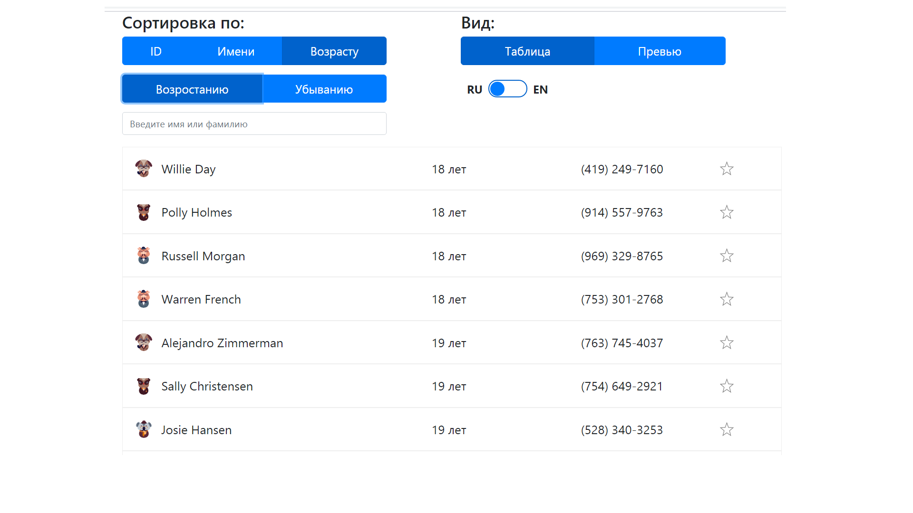

# Тестовое задание с интересным функционалом.

## Выполнение тестового задания на позицию React + Redux разработчика в [студии Олега Чулакова ](https://chulakov.ru/).

**Ссылки:**

:arrow_right: [демо-версия](https://d00dde.github.io/Test-chulakov) готового приложения; 
:arrow_right: [задание](https://chulakov.ru/career/frontend-react-developer) (на сайте); 
:arrow_right: [копия заданния](https://github.com/d00dde/Test-chulakov/blob/master/public/conditions/%D0%A2%D0%B5%D1%81%D1%82%D0%BE%D0%B2%D0%BE%D0%B5%20%D0%B7%D0%B0%D0%B4%D0%B0%D0%BD%D0%B8%D0%B5%20Frontend.%20React%2BRedux%20%D1%81%20%D0%B0%D0%BD%D0%B8%D0%BC%D0%B0%D1%86%D0%B8%D1%8F%D0%BC%D0%B8%20%D0%A1%D1%82%D1%83%D0%B4%D0%B8%D1%8F%20%D0%9E%D0%BB%D0%B5%D0%B3%D0%B0%20%D0%A7%D1%83%D0%BB%D0%B0%D0%BA%D0%BE%D0%B2%D0%B0.pdf) (в репозитории); 
:arrow_right: [материалы](https://github.com/d00dde/Test-chulakov/tree/master/public/conditions) к заданию. 

:clipboard: **Описание:** Приложение получает с сервера (эмуляции) JSON-файл с данными о пользователях, отображает их в виде таблицы либо в виде предпросмотра. Реализована сортировка и фильтрация пользователей, смена типа отображения и смена языка интерфейса без перезагрузки страницы. Реализована анимация при появлении элементов и автозапуск/остановка проигрывания видео в зависимости от прокрутки страницы (без сторонних библиотек). Компоненты адаптируются под ширину экрана. Реализована установка и считывание активных фильтров в адресную строку браузера. Приложение использует Redux.

**Использованы технологии:**

:wrench: базовые технологии React; 
:wrench: SPA; 
:wrench: Redux; 
:wrench: React hooks (в том числе пользовательские); 
:wrench: адаптивный дизайн (media-запросы); 
:wrench: анимация при помощи native CSS; 
:wrench: Styled Components; 
:wrench: работа с Intersection Observer; 
:wrench: работа с HTML 5 video API; 
:wrench: работа с location и history; 
:wrench: смена языка без перезагрузки страницы; 
:wrench: создание и подключение лоадеров; 
:wrench: методы обработки ошибок в приложении. 
